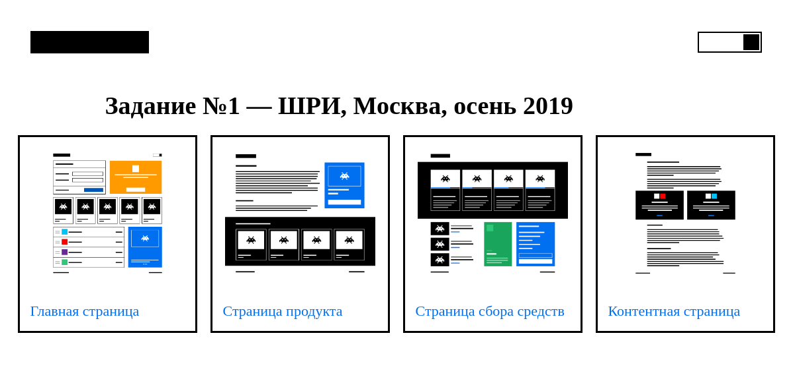

# Задание 1. Реализуйте дизайн-систему
В этом репозитории находятся файлы решения тестового задания «Реализуйте дизайн-систему» для 15-й Школы разработки интерфейсов (осень 2019, Москва).

## Примечания
Команда `npm run start` запускает локальный сервер со страницами, собранными из блоков дизайн системы
